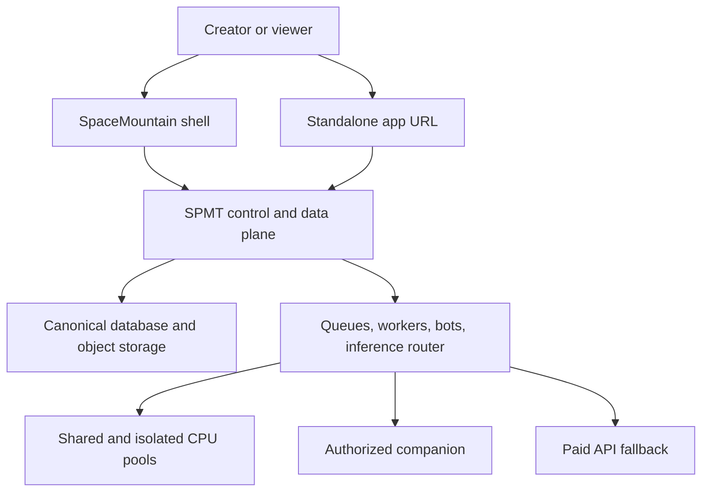

# Proposed Blueprint

Status: proposed; subject to `DECISIONS.md`.

## Design goals

1. One human identity and authorization system.
2. One authoritative home for every shared fact.
3. Fast public shells with honest loading behavior.
4. Stateless product runtimes that can stop when idle.
5. Selective isolation for expensive or risky work.
6. Local-first AI where it is useful, paid APIs where required.
7. Every cost, request, mutation, and migration attributable to a tenant.
8. No silent fallback, fake success, or shadow database.
9. First-party apps are the reference implementations for the public developer platform.

## Logical architecture

SPMT is one **logical** application and API doorway. Its storage-authority process can own and mount the authoritative Fly Volume and the tools needed to index, search, store, retrieve, and serve that data. Other apps never mount that volume directly; they reach the authority through supported SDK, API, CLI, MCP, WebSocket, event, or job contracts.

## First-party apps prove the developer platform

The owner-operated applications are the platform's first customers. They use the same versioned developer surfaces available to an approved external application instead of private database access, made-up shared secrets, or undocumented one-off routes.

For TypeScript application code, `@spmt/sdk` is the default integration boundary. Raw HTTP is reserved for unsupported runtimes, diagnostics, and proving the wire contract. Operator and automation workflows use the `spmt` CLI or MCP tools. Asynchronous integration uses versioned events, webhooks, WebSocket streams, and durable jobs rather than polling another app's private storage.

Every important first-party capability must leave behind a reusable developer asset: a versioned contract, SDK method, CLI command or MCP tool where appropriate, scoped authorization, an executable example, contract tests, and observable success/failure behavior. A feature demonstrated only through a private first-party UI is incomplete.

This is parity of capability and policy, not identical deployment privilege. SPMT's storage adapter, same-process implementation details, and fenced recovery operations may remain internal, but they must sit behind the same authorization, tenant, validation, idempotency, audit, and error semantics seen by public clients. Any exception is documented, narrowly scoped, tested, and reviewed.

`DEVELOPER_PLATFORM.md` defines the proof matrix and release gate.

## SpaceMountain: always-available front door

SpaceMountain serves the real navigation, app catalog, last-known public snapshot, account state, and loading/error surfaces. It does not pretend that a stopped backend accepted a mutation.

When an app is cold:

1. the shell renders immediately from static assets and safe cached data;
2. the gateway requests or triggers backend readiness;
3. mutation controls remain disabled or explicitly queued;
4. the real app hydrates when readiness passes;
5. failure becomes a visible retry/degraded state, never simulated success.

For a standalone app URL to show a shell before its backend wakes, the domain must terminate at an always-available gateway/static host. A stopped app cannot serve its own pre-wake shell.

## SPMT: control plane and data plane

SPMT owns:

- canonical identity, sessions, linked providers, tenants, roles, and consent;
- OAuth clients, short-lived access tokens, refresh/revocation, and scoped service identities;
- app registry, installs, entitlements, plans, quotas, and device registry;
- canonical shared facts and mutation contracts;
- append-only events, audit records, idempotency, and reconciliation provenance;
- routing metadata, readiness, job submission, and usage/cost records.

SPMT should be highly available as a logical service. If the first release uses one authoritative volume attached to one storage Machine, that single-writer boundary must be explicit, always-on, backed up, monitored, and paired with a rehearsed recovery plan.

### Independent recovery authority

Full redundancy is required. A separate recovery app—provisionally `spmt-vault`—owns its own Machine and volume in a different Fly hardware zone or region. It is not a SpaceMountain process group and does not share SPMT deployment credentials, so a bad front-door or SPMT deployment cannot erase the recovery path.

In normal operation the recovery Machine is stopped or runs at the smallest justified size. It boots on a defined schedule to:

1. obtain a consistent encrypted snapshot plus the committed change journal;
2. validate checksum, database integrity, schema version, tenant counts, and recoverability;
3. retain versioned recovery points instead of replacing the only good copy;
4. report backup age and verification status to the control plane;
5. stop again after the backup is complete.

SpaceMountain knows both authority endpoints and can route a controlled failover, but it does not own the backup bytes.

The recovery app protects against a primary Machine, volume, region, or deployment failure. A small encrypted, versioned, immutable copy outside the primary Fly app/organization failure boundary is still recommended for account-level deletion, control-plane compromise, or a provider-wide incident. That archival copy is not promoted directly; it is a last-resort restore source.

During catastrophic primary failure, the system fences the old primary before promoting the recovery authority. Promotion assigns a monotonically increasing authority epoch, changes the backup from read-only to single writer, and routes SPMT data traffic to it. Writes accepted during failover are journaled so the recovered primary can be rebuilt from the promoted authority before a planned failback.

A security breach is different from a hardware outage. Suspected compromised data is never automatically folded into a clean primary. Credentials are revoked, both sides are frozen, a known-good recovery point is selected, verified post-snapshot events are replayed, and an audit is completed before either side becomes authoritative.

## Storage model

The rejected implementation is “attach every app to one shared Fly Volume.” Fly Volumes belong to one Fly app, attach to one Machine, and are not automatically replicated.

The proposed implementation is:

- one storage-authority app that exclusively mounts any authoritative Fly Volume;
- an internally selected database/index/file layout behind that authority;
- optional object storage for images, audio, clips, exports, and generated media when durability, scale, or delivery makes it preferable to the volume;
- a queue or durable job table for asynchronous work;
- optional cache only for disposable derived data;
- SPMT APIs as the only supported client boundary;
- separate schemas/tables and tenant keys, not separate truth databases per app;
- small app-local volumes where an app genuinely needs private durable state, a disk-backed cache, a retry buffer, or temporary staging before an idempotent write to the authority.

Local app volumes are not shared authorities. Cached shared data must be replaceable, have a freshness/version rule, and never overwrite newer canonical state. Staged writes require an idempotency key, retry status, bounded retention, and dead-letter/operator recovery.

The final database/file provider, backup interval, retention, region, recovery-point objective, and recovery-time objective remain debate decisions. The independent recovery authority itself is required. The storage contract must allow its implementation to change without changing app APIs.

## One fact, one authority

| Fact | Canonical authority | Allowed local copy |
|---|---|---|
| Identity and linked accounts | SPMT | short-lived session cache |
| Points/XP | SPMT append-only ledger | rebuildable projection |
| Themes/backgrounds | SPMT workspace profile | last-known display cache |
| Cards/collections | SPMT shared catalog/ownership service | app UI projection |
| Images/media metadata | SPMT metadata + object storage | CDN/browser cache |
| Shoutout counters | SPMT typed event/projection | rebuildable display cache |
| Plans/AI quota/entitlements | SPMT | signed short-lived decision cache |
| Game round/session state | owning app/runtime | only while active; durable outcomes published |
| Worker scratch data | worker | disposable |
| App-private durable state | owning app | small local volume, when no other app consumes it |
| Pending canonical write | originating app until acknowledged | bounded durable outbox/retry buffer |

Apps may own specialized rules and temporary runtime state. They may not create a competing answer to a shared fact.

## Authentication and authorization

The target is one SPMT account, not one omnipotent shared secret.

- Humans: SPMT authorization code flow with secure browser session, PKCE where applicable, exact redirects, state validation, short-lived access, refresh rotation, and revocation.
- First-party services: one registered service identity per deployable, using least-privilege scopes and short-lived tokens.
- First-party integrations: the same OAuth, SDK, API, event, webhook, job, CLI, or MCP contract used by an equivalent external client; first-party ownership alone grants no implicit tenant authority.
- Provider credentials: Twitch, Discord, Xbox, and paid AI credentials remain real secrets because SPMT cannot invent replacements for third-party credentials.
- Internal same-process calls: direct modules, not HTTP plus made-up secrets.
- Tenant/user context: explicit and separately authorized; never inferred from a service secret alone.
- Secrets: stored in the deployment secret store, never files, repos, public JSON, logs, or generic headers reused across unrelated routes.

Standalone means an app has its own working URL and can restore SPMT identity directly. It does not mean the app invents a local account when SPMT is unavailable.

## Fly runtime model

Fly Machines belong to Fly apps; unrelated Fly apps do not opportunistically share the same Machine. To consolidate lightweight services, package compatible modules into a small number of deployables/process groups. Keep failure, security, and scaling boundaries separate where they matter.

### Always on

- SpaceMountain gateway/shell: minimum healthy capacity to keep the front door available.
- SPMT API/control plane: minimum redundant healthy capacity.
- canonical data service: availability appropriate to tenant-loss risk.
- small scheduler/queue authority and monitoring path.

### Scale to zero or near zero

- ordinary app APIs without persistent connections;
- burst workers;
- media transforms;
- CPU inference pools;
- previews and noncritical utilities.

Fly Proxy autostart starts existing Machines; it does not create limitless Machines. Dynamic creation/destruction requires the Machines API or Fly's metric autoscaler. Background work must use explicit worker lifecycle because a returned HTTP request can make a Machine look idle while work is still running.

### Selective isolated workers

- Xbox sessions: one worker lease per active streamer plus one ready standby while any lease is active. When zero are active, keep a stopped/suspended reserve rather than a paid running standby.
- High-CPU or untrusted jobs: isolated worker lease with resource and time limits.
- LLM persona/chat: shared inference pool by default; isolate only models or tenants whose memory/resource/security requirements justify it.
- Long-lived bots and provider sockets: activity-aware process group managed by heartbeat/lease, not ordinary HTTP autostop.

Every lease has an owner, TTL, heartbeat, state, maximum, drain rule, and cleanup rule. A reconciler repairs abandoned leases.

## AI and media generation

One inference router exposes versioned chat, TTS, STT, embedding/classification, and image-job contracts.

Routing order is policy-driven:

1. authorized companion when available and suitable;
2. Fly CPU pool for small quantized models and CPU-friendly work;
3. paid external API for quality, large models, GPU-only work, overflow, or failure.

The router records provider, model, tenant, request class, latency, estimated cost, credits charged, and fallback reason without logging private prompts by default.

Fly is not the in-house GPU tier. Image generation and heavy GPU inference require the companion or an external GPU/API provider.

## Freemium model

AI compute credits are separate from community points.

| Tier | Hosted allowance | Companion behavior | Priority |
|---|---|---|---|
| Free | generous but bounded | local work does not consume hosted credits | standard |
| Free + Companion | same hosted fallback allowance | local CPU/GPU first | standard |
| Premium | materially higher bounded allowance | optional | higher |
| Premium + Companion | high hosted fallback plus local capacity | local first where suitable | highest |

Use weighted credits internally: text tokens, audio duration, model class, image jobs, and retry/fallback cost are not equivalent. Apply a short abuse window and a longer plan allowance. “Unlimited” is not promised.
