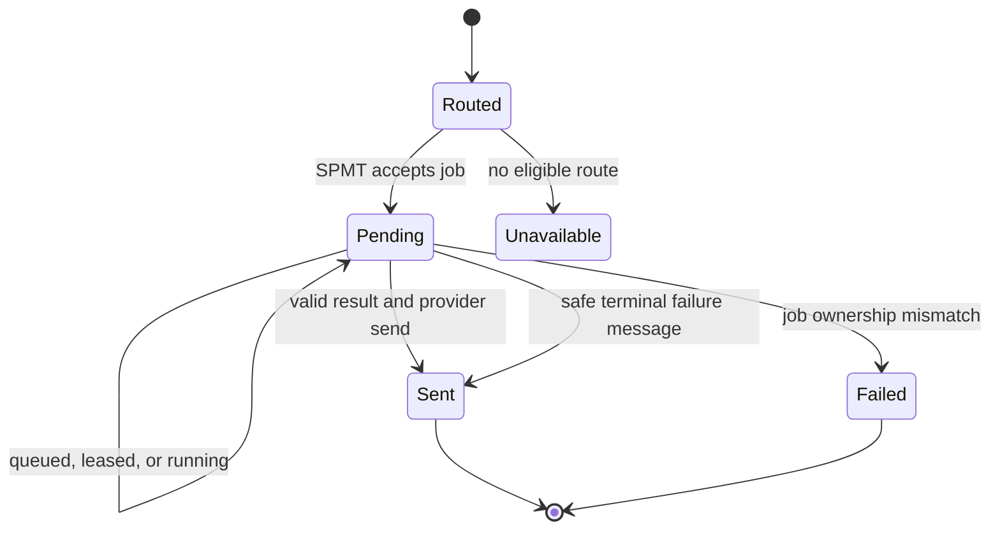

# StreamWeaver → Stellar reply loop

Status: implemented behind the Chat Gateway shadow route on 2026-08-28.

This document defines the internal boundary that turns an inbound normalized chat delivery into a metered Stellar job and, later, one logical provider reply. It does not authorize live provider credentials or production socket cutover.

## Ownership

| Concern | Authority |
|---|---|
| Twitch, Discord, and Kick socket I/O | Chat Gateway |
| Provider-to-canonical identity | SPMT identity authority |
| Persona name, aliases, home channels, summon window | StreamWeaver app-private state |
| Job routing, usage admission, hosted/Companion choice | SPMT + Stellar Core |
| Prompt execution and result | Stellar Core |
| Pending provider reply | StreamWeaver app-private SQLite outbox |
| Provider send | Chat Gateway egress |

Stellar Core remains persona-neutral. StreamWeaver owns the tenant's presentation and routing. Tenant-specific persona instructions and memory policy are a later migration and must not be written into the global Stella identity.

## State flow

The original Chat Gateway delivery ID becomes the Stellar idempotency key and the reply-outbox primary key. A retry after a crash therefore resolves the same job and the same logical reply. The provider egress idempotency key is `streamweaver-persona-result:<deliveryId>`.

## Authorization boundary

StreamWeaver receives `assistants:invoke` and `jobs:read`; it does not receive `jobs:any`.

A service may read a known job when one of these is true:

- it owns the job;
- it is the execution owner;
- it is the authenticated service recorded as the original requester.

The requester rule is intentionally limited to `GET` by known job ID. The ordinary service list path remains owner-filtered, so StreamWeaver cannot enumerate Stellar Core's work. Before any reply, the reconciler additionally checks tenant ID, job ID, owner, capability, requester type/ID, and `callerAppId`.

## Persistence and failure behavior

The outbox stores only delivery coordinates, public display name, job ID, timestamps, and redacted failure evidence. It does not store provider credentials or duplicate prompt/result bodies.

- Queued, leased, and running jobs are deferred with a bounded polling interval.
- Provider-send failures remain pending and retry with the same egress idempotency key.
- A valid succeeded job emits its bounded public result.
- Failed, cancelled, dead-letter, or malformed-result jobs emit a safe truthful terminal message without upstream secret/error detail.
- A job that no longer matches the authenticated StreamWeaver request is permanently rejected without provider egress.

## Production gates still closed

- provider OAuth refresh credentials must enter the SPMT provider-grant authority;
- Twitch/Discord/Kick connections must pass credentialed two-tenant reconnect and egress rehearsal;
- tenant persona instructions and memory policies must migrate into versioned StreamWeaver settings;
- the Chat Gateway/StreamWeaver worker group needs live lease, drain, restart, and rollback evidence;
- Blue provider bots remain authoritative until those proofs and owner acceptance are recorded.
